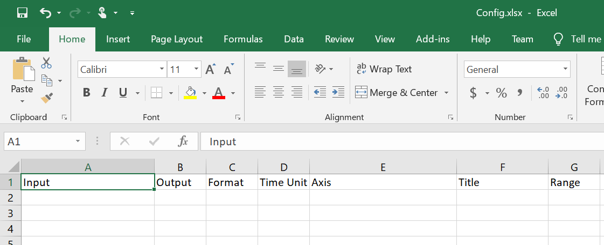

# Data Processing

A data processing Python executable that will take in a CSV file and 

>1) create an Excel version of the CSV file 
>2) import only the desired data into an Excel, JPEG, PDF, and text file 
>3) create a plot of the processed results with Excel and matplotlib 

## General Info

The purpose of this project is to develop an automated processing program that will streamline data formatting of routinely conducted experiments. The software will take in a CSV file and output an Excel version of the CSV file as well as a Excel, JPEG, PDF, and/or text file of the processed results. The Excel, JPEG, and PDF files will contain a chart of the processed results. 

All the output files will be stored in a subdirectory titled `filename_of_output_files`. 

## Getting Started

### Prerequisites 

The application code is built with Python 3.7. Package Dependencies: `numpy`, `pandas`, `matplotlib`, `openpyxl`, `PyPDF2` **_However, the software that you need to run is a standalone executable_**

Users will need an Excel file to serve as the configuration file. 

### Running 
To run the program, run `main.exe`. Make sure the CSV and the configuration file are in the same directory as the executable. The program will continue to repeat as long as the user enters 'Y' or 'y' when prompted if they want to process another file. 

## Background
'Sheet 1' of the configuration file gives the ‘Mapped Settings’ of the program. The sheet should look like: 

**_Except for 'Title' all inputs are case insensitive._**

Each row in the configuration file corresponds to a single column of data in the CSV file. 
- **Input** (str): Column letters of the columns we want mapped
- **Output** (str): Column letters of the columns we want the processed data to be mapped to in the output Excel file 
- **Format** (int): Sig figs we want the data to be rounded to
- **Time Unit** (str: 'D', 'M', 'H', 'S'): How time is represented. 'D' is datetime, 'H' is hours, 'M' is minutes, and 'S' is seconds. Corresponding CSV column will convert the time into elapsed time with format HH:MM:SS   
- **Axis** (str: 'X', 'Y') Indicate whether CSV column will serve as an axis on the graph. 'X' for x-axis, 'Y' for y-axis. Can have multiple y-axis. 
- **Title** (str): Title of the CSV column in the output files 
- **Range** (str: '\[Start]:\[End]') : Interval of data in column that is to be processed. Indices will be based off of the data itself, not the Excel row numbers. 

'Sheet 2' gives the 'General Settings' of the program. The sheet should look like: 

**_All inputs are case insensitive._**

Each column will contain only 1 value. 

- **ChartTitle** (str): Title of chart
- **Start Row** (int): Row to begin processing CSV file. Index will be based on CSV file. Must start at column title row.  
- **Stop Row** (int): Row to stop processing CSV file. 
- **Skip First Row** (str: 'Yes', 'No'): Indicate whether you want to skip the first row of data. Prevents elapsed time from being based off of a time value from a previous experiment. 
- **X Min** (float): Minimum value on x-axis of chart. Does not work on datetimes or timedeltas. 
- **X Max** (float): Maximum value on x-axis of chart. Does not work on datetimes or timedeltas. 
- **Y Min** (float): Minimum value on y-axis of chart. Does not work on datetimes or timedeltas. 
- **Y Max** (float): Maximum value on y-axis of chart. Does not work on datetimes or timedeltas. 
- **Grid Lines** (str: 'Yes', 'No'): Indicate whether grid lines on chart will be turned on or off
- **Excel** (str: 'Yes', 'No'): Indicate whether an Excel file of processed results will be generated
- **JPEG** (str: 'Yes', 'No'): Indicate whether a JPEG file of processed results will be generated
- **PDF** (str: 'Yes', 'No'): Indicate whether a PDF file of processed results will be generated 
- **TXT** (str: 'Yes', 'No'): Indicate whether a txt file of processed results will be generated
- **Transpose** (str: 'Yes', 'No'): Indicate whether table is to be transposed 

### Default Options

**_'--' indicates that there will be no error generation if no value is inputted._**

In 'Sheet 1': 
- **Input**: N/A
- **Output**: N/A
- **Format**: --
- **Time Unit**: --
- **Axis**: --
- **Title**: Title of the column in the CSV file 
- **Range**: All 

In 'Sheet 2': 
- **Graph Title**: Syntax will be '\[All] y-axes vs x-axis'
- **Start Row**: 1
- **Stop Row**: --
- **Skip First Row**: No
- **X Min**: --
- **X Max**: --
- **Y Min**: --
- **Y Max**: --
- **Grid Lines**: Yes
- **Excel**: Yes
- **JPEG**: Yes
- **PDF**: Yes
- **TXT**: Yes
- **Transpose**: No

## Warnings: 
- Cannot set scale limits on elapsed times, as Excel and matplotlib cannot scale datetime or timedelta objects. 
- matplotlib limits may not be scaled according to exact specifications. 
- matplotlib scales break down when the minimum and maximum are too far apart, i.e. 20 and 1000 
- Excel can graph axes with different lengths. For the most part, matplotlib cannot. (Exceptions do occur when the values stay constant throughout but the graphs of Excel and matplotlib will contain errors.) 
- **Range** column must be formatted so it is read as 'Text,' otherwise it will be converted into time. 
- Milliseconds will be removed when converting into elapsed time. 
- A JPEG file will not be generated if a chart is not processed, even if **JPEG** is set to 'Yes.' An Excel and PDF file can still be generated without a chart addition.

## Future Refinements
- Replace text interface with a GUI using PyQt5. 

